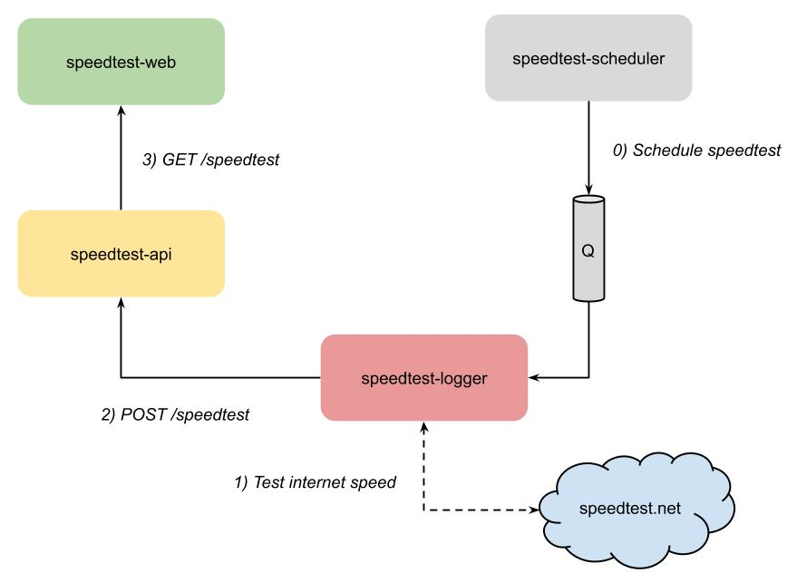
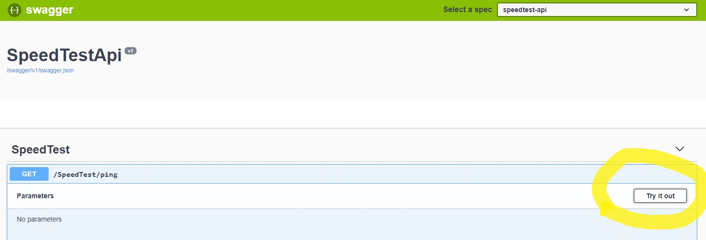
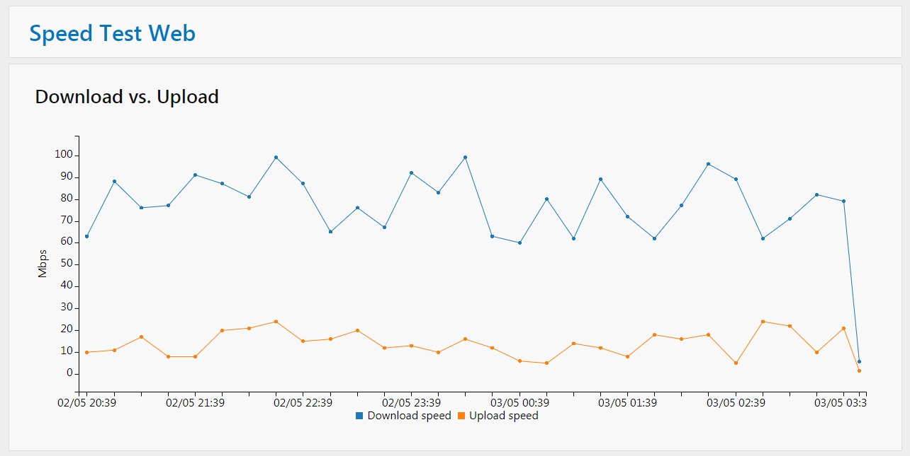

[Index](index) > Any engineering worth doing, is worth over-doing
=================================================================
_In this section, we'll introduce the distributed system we'll be working with. This system might be familiar for those who participated in the [cloud-101 workshop](https://cx-cloud-101.github.io/speedtest-workshop/). Let's have a look at **Distributed Speed Test Microservice Containers (DSTMC)™** from **k8s-101 Solution Industries©**!_

What problem are we trying to solve?
------------------------------------
Have you ever wondered if your ISP is delivering the internet speed you pay for? When you just want to watch the [new youtube-video](https://www.youtube.com/watch?v=NhjiIPohUyw) on your favorite channel after a long day of work, but the video keeps buffering. Or when your download is perpetually stuck on 98%. I bet you have!

With the video still buffering, you head on over to a site like [speedtest.net](https://www.speedtest.net/), ready to catch your ISP red-handed in the act of throttling your internet connection, but every time the problem seems to magically disappear when you click the "test internet speed button".

Wouldn't it be nice if someone could watch your back? Run tests at regular intervals, measure your internet download and upload speed, and store it safely in a database, ready to be displayed in av web-based graphing solution?

With the all new _Distributed Speed Test Microservice Containers (DSTMC)™_ from _k8s-101 Solution Industries©_ you no longer have to live in a world of uncertainty. Let _DSTMC™_ watch your back, so you and your business can reach new top quadrants in all internet-browsing based activities.

**DSTMC™** _Measure internet speed with the professionals preferred performance!_


How does Distributed Speed Test Microservice Containers (DSTMC)™ work?
----------------------------------------------------------------------
Our top minds at k8s-101 Solution Industries© have designed and implemented a novel four-part system for measuring internet speed.



### speedtest-scheduler
The speedtest-scheduler is responsible for scheduling internet speed tests. At _k8s-101 Solution Industries©_, we're keenly aware that scheduling is a task of such importance, that it must never be the responsibility of the program actually tasked with doing anything, so the schedulers only task is to produce a message requesting that a speedtest will be run.

### speedtest-logger
Running speed tests, and measuring internet speed, is the responsibility of the speedtest-logger. It will act when requested to do so by the speedtest-scheduler, perform an internet speed test against the [speedtest.net](https://www.speedtest.net/) servers, and then pass on the test result to the speedtest-api, by POST'ing to an API endpoint.

### speedtest-api
Storage of speed test results is the responsibility of the speedtest-api. It is also responsible for retrieving speed tests, so they can be displayed by speedtest-web.

### speedtest-web
Speedtest-web is a website displaying two graphs. One for download and upload -speed, and one for ping.

Let's get it all down and running!
----------------------------------
Before we start dockerizing and deploying the speedtest services, let's download, build and run them locally, to better understand how they work together.

### speedtest-logger
1. Clone the codebase from GitHub with `git clone https://github.com/k8s-101/speedtest-logger.git`.
2. Navigate into the `/speedtest-logger/SpeedTestLogger`-folder, and build the solution with `dotnet build`.
3. Open `appsettings.json` in your favorite editor, ensure that _singleRun_ is set to `true`, and update _userId_ with a suitable name.
4. Finally, run speedtest-logger with `dotnet run`

```shell
$> speedtest-logger/SpeedTestLogger> dotnet run
Starting SpeedTestLogger
Finding best test servers
Testing download speed
Testing upload speed
Got download: 5,8 Mbps and upload: 1,61 Mbps
Uploading data to speedtest API
Upload failed! No connection could be made because the target machine actively refused it
Speedtest failed!
Application started. Press Ctrl+C to shut down.
Hosting environment: Production
Content root path: /speedtest-logger/SpeedTestLogger/bin/Debug/netcoreapp2.1/
SpeedTestLogger stopped
```

Great success! We measured a download and upload -speed, but failed to upload it. Why did the upload fail? That's because we haven't started speedtest-api yet!

_What's the deal with "Application started" and "Content root path"? speedtest-logger is actually implemented as a hosted service using [.NET Generic Host](https://docs.microsoft.com/en-us/aspnet/core/fundamentals/host/generic-host?view=aspnetcore-2.2), and we're forcing it to emulate a simple console program. This is totally overkill at this stage, but will probably make sense later in the workshop._

### speedtest-api
1. Navigate out of `/speedtest-logger` and again clone the codebase from GitHub with `git clone https://github.com/k8s-101/speedtest-api.git`.
2. Navigate into the `/speedtest-api/SpeedTestApi`-folder, and run the solution with `dotnet run`.

```shell
&> speedtest-api/SpeedTestApi> dotnet run
Hosting environment: Development
Content root path: .../speedtest-api/SpeedTestApi
Now listening on: https://localhost:5001
Now listening on: http://localhost:5000
Application started. Press Ctrl+C to shut down.
```
3. Open your favorite browser and go to [localhost:5000/swagger](http://localhost:5000/swagger/index.html). You should be able to see Swagger UI, and try out the API.



4. Try to run the speedtest-logger again from another terminal, keeping speedtest-api still running. This time upload should work.

```shell
$> speedtest-logger/SpeedTestLogger> dotnet run
Starting SpeedTestLogger
Finding best test servers
Testing download speed
Testing upload speed
Got download: 5,8 Mbps and upload: 1,61 Mbps
Uploading data to speedtest API
Speedtest complete! <- This is the important change!
Application started. Press Ctrl+C to shut down.
Hosting environment: Production
Content root path: /speedtest-logger/SpeedTestLogger/bin/Debug/netcoreapp2.1/
SpeedTestLogger stopped
```

Let's keep speedtest-api running, while we get speedtest-web up and running in another terminal.

### speedtest-web
1. Clone the codebase from GitHub with `git clone https://github.com/k8s-101/speedtest-web.git`.
2. Navigate into the `/speedtest-web/SpeedTestWeb`-folder, and run the solution with `dotnet run`.

```shell
&> speedtest-api/SpeedTestApi> dotnet run
Hosting environment: Development
Content root path: .../speedtest-api/SpeedTestApi
Now listening on: https://localhost:5051
Now listening on: http://localhost:5050
Application started. Press Ctrl+C to shut down.
```
3. View speedtest-web at [localhost:5050/index.html](http://localhost:5050/index.html).



_Wait, where did all the data in the graphs come from? When started locally, speedtest-api will populate it's database with some dummy-data, so we have something to display in the webpage. This won't happen if you run the application in production-mode, i.e. with the environment-variable `ASPNETCORE_ENVIRONMENT` set to `true`._

### speedtest-scheduler
We'll skip speedtest-scheduler for now, since running it requires setting up a third-party queue solution, and we're to lazy to do that on our local computer. For now you can pretend like it doesn't exist, but fear not, we'll return to speedtest-scheduler in part 4, [the third party queue](4-third-party-queue).

What now?
---------
Now that we have familiarized ourselves with the speedtest system, lets continue by dockerizing the system in the [next sections](2-docker-and-conatiners).