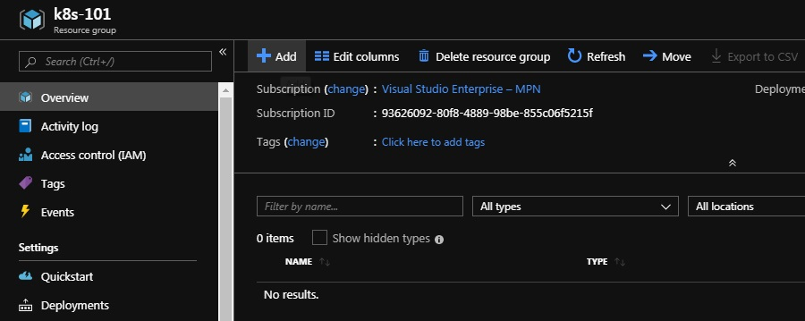
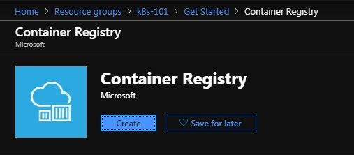
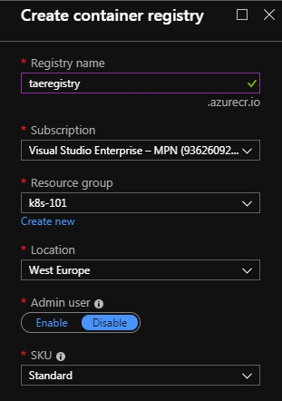
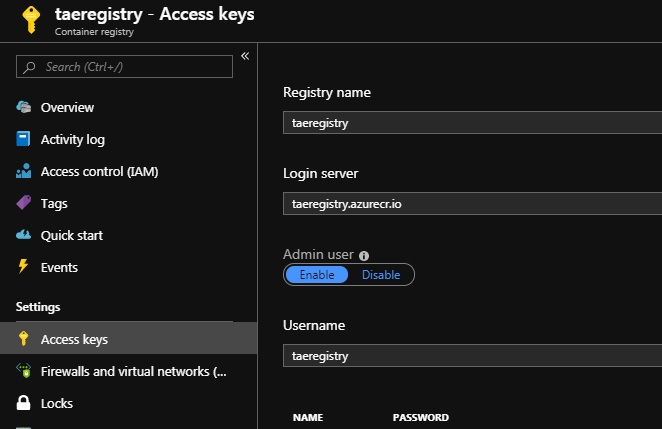
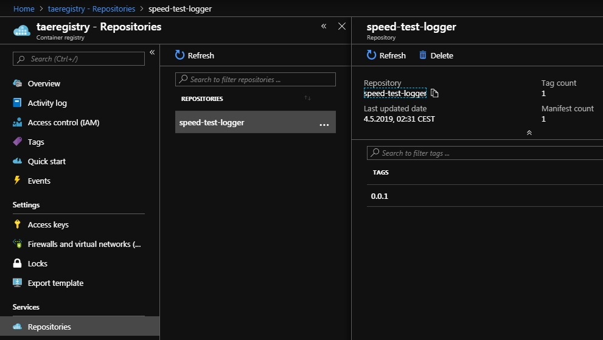
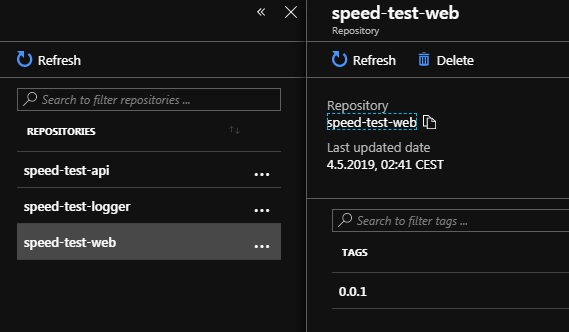

[Index](index) > Sharing images with a Docker registry
======================================================
_In the previous section we built three small Docker images on our local computer. Now we want to upload them to a registry, so we can run them on other machines._

What's a Docker registry?
-------------------------
As we previously touched in on, a docker registry is an online library over Docker images. It works a bit like [NuGet](https://www.nuget.org/) and [npm](https://www.npmjs.com/) but with images instead of code.

The most common registry to use is the public [docker hub](https://hub.docker.com/_/microsoft-dotnet-core). Here you'll find images for a lot of [common and uncommen software](https://hub.docker.com/search?q=&type=image), and anyone are free to create an account and publish their own images. Docker hub is also the default registry supported by most docker-related tools.


Let's create a Container Registry on Azure
------------------------------------------
For most projects, using docker hub is a good fit, but in some cases you might want to create your own private registry. Since we're already going to be using Azure, we'll create a private container registry hosted on Azure from the [Azure portal](https://portal.azure.com/).

Create a new resource group named _k8s-101_ in the region _(Europe) West Europe_.


Go to the resource group you just created and add a new Container Registry.





Give your registry a short and sweet and unique name, one possibility id _{your initials}registry_, and set the resource group to _k8s-101_.



When the registry is up and running, open it and make a note of your login server. As an example, we'll be using `taeregistry.azurecr.io` for the duration of this workshop, but you should use your login server address instead.


You'll also need to enable _Admin user_, and note your username and password under _Access keys_.



Now you should be able to login to your container registry using `docker login`.
```shell
$> docker login taeregistry.azurecr.io
Username: taeregistry
Password:
...
Login Succeeded
```
_You can safely ignore any warnings about storing unencrypted passwords and configuring credentials helper. After all this is not a real production registry._


Pushing speed-test-logger to the registry
-----------------------------------------------
Before we push the image `speed-test-logger:0.0.1` to the registry, we need to tag it with a fully qualified path to our new registry. That means we want to tag it along the lines of `taeregistry.azurecr.io/speed-test-logger:0.0.1`. One way of doing this would be to re-building the image with the fully qualified tag:
```shell
$ speedtest-logger> docker build -f Dockerfile -t taeregistry.azurecr.io/speed-test-logger:0.0.1 ./
```
* `-t taeregistry.azurecr.io/speed-test-logger:0.0.1` tags the image when building.

An slightly easier alternative is just to tag the already build images using `docker tag`:
```shell
$> docker tag speed-test-logger:0.0.1 taeregistry.azurecr.io/speed-test-logger:0.0.1
```

With the tagging done, we can move on to pushing `taeregistry.azurecr.io/speed-test-logger:0.0.1`:
```shell
$> docker push taeregistry.azurecr.io/speed-test-logger:0.0.1
The push refers to repository [taeregistry.azurecr.io/speed-test-logger]
60de89799169: Pushed
5e5f959b8e85: Pushed
7011a9e7d535: Pushed
9045fcfa3e8c: Pushed
d224e574c0ab: Pushed
5dacd731af1b: Pushed
0.0.1: digest: sha256:b44956fa936c266c448ff9a63d234a2315fd1b558bf77cf59a7fbe3730fb5cb0 size: 1583
```

At this point we should be able to view our image from the Azure portal by visiting the repositories page of the container registry:



### Pushing speed-test-api and speed-test-web
Again we'll leave you on your own when it comes to pushing `speed-test-api:0.0.1` and `speed-test-web:0.0.1`. The steps will be just the same as for the logger, just remember to use the correct tags!

When you're done, you should be able to see all three images up on Azure.




What now?
---------
With a dockerized system, we're ready to [create Kubernetes cluster and deploy our application](3-kubernetes-and-container-orchestration).
