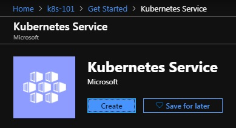
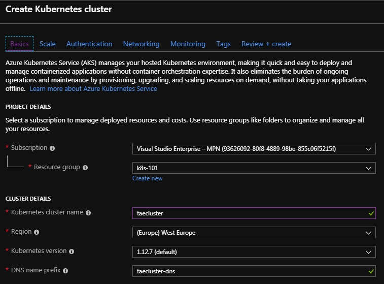

[Index](index) > Kubernetes and container orchestration
=======================================================
_Time to deploy our docker containers! in this section we'll create a Kubernetes cluster on Azure, and deploy the speedtest system on it._

A bit about Kubernetes
----------------------
Kubernetes is a container orchestration system, originally built by Google. Kubernetes can help us with several things:
* Kubernetes provides several higher level abstractions that allow us to compose containers into more advanced applications and network them together.
* When a container crashes, Kubernetes can restart the failing container.
* It maps physical or virtual computing resources together in a cluster, so we can scale the underlying infrastructure without changing the infrastructure hosting our application.
* If demand rices or sinks, Kubernetes can scale our application up or down.
* It has built-in systems for handling configuration and management of secrets like passwords and so on.

In short, Kubernetes is a bit like a cloud-platform for container-based applications, and like a cloud platform we'll just be able to scratch the surface of Kubernetes in this workshop. We'll manly focus on Kubernetes features for hosting and deploying container-based systems.

Creating the cluster
--------------------
Before we can play with Kubernetes, we'll need a Kubernetes cluster. Let's create one on Azure.

Start by navigating to the _k8s-101_ resource group, and create a Kubernetes Service.

You have an awful lot of options when creating the cluster, but for our purposes, the important parts are:

Under _Basic_:
* Resource group should be _k8s-101_.
* The Kubernetes cluster name should be short and unique, for example {your initials}cluster. We'll be using `taecluster` for the duration of this workshop, but you should use your 
* Region should be _(Europe) West Europe_.

Under _Authentication_:
* *Important* Turn off _Enable RBAC_

Leave everything as-is under _Scaling_, _Networking_, _Monitoring_ and _Tags_, and then create your cluster under _Review + create_.

Creating the cluster will take quite a bit of time. Let's get started preparing speedtest-api for deployment on Kubernetes while we wait.

Deploying speedtest-api to Kubernetes
-------------------------------------
This time we'll start with speedtest-api for a change.
TODO: Here we introduce Kubernetes YAML-files, and write a deployment and service for speedtest-api.

Running speedtest-logger as a job
---------------------------------
TODO: Less introduction, more faster. At this point we probably inspect the logs.

Deploying speedtest-web
-----------------------
TODO: Very fast, just the same as speedtest-api.

What now?
---------
We have deployed the basic speedtest system to Kubernetes, but what should we do with speedtest-scheduler? Join us in the [next section](4-third-party-queue) where we'll install a third-party queue, and trigger speedtest-logger based on messages from speedtest-scheduler.